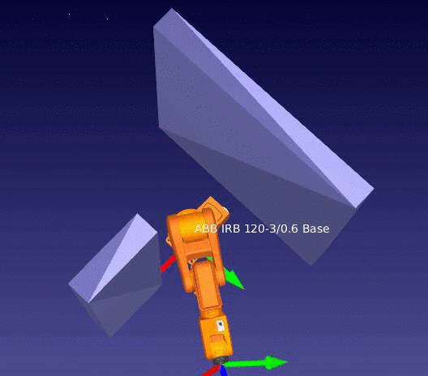

# Bubble PRM
Sampling based motion planning framework which uses probabilistic roadmap algorithm (PRM), along with bubbles of free configuration space.

End product examples:

(Animations were recorded in [RoboDK](https://www.robodk.com/).)
