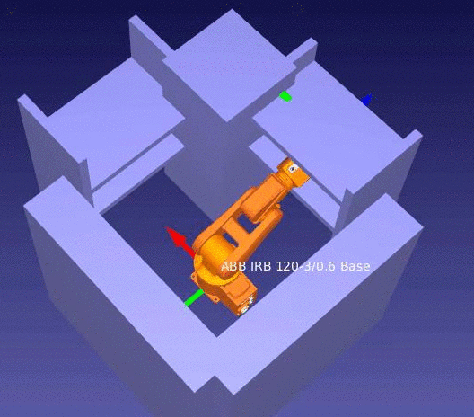

# Bubble PRM
Sampling based motion planning framework which uses probabilistic roadmap algorithm (PRM) with Quinlan's bubbles of free configuration space.

End product examples:

(Animations are recorded in RoboDK.)
